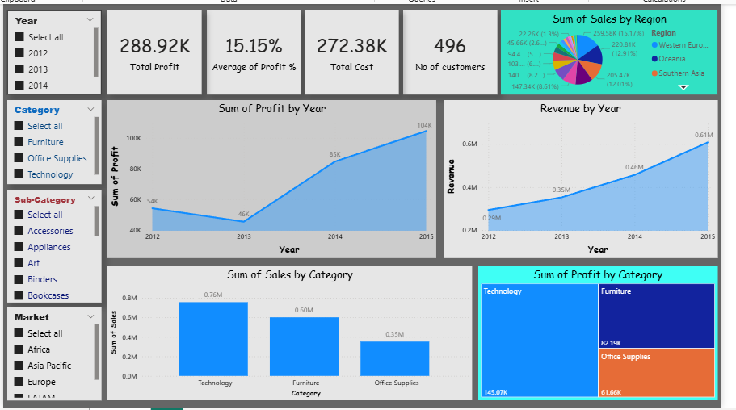

# Sales-Analysis-PowerBI
# Sales Analysis Dashboard
## Overview
Interactive Power BI dashboard designed to analyze sales performance, profitability, customer trends, and regional sales distribution.

## Tools Used
- Power BI
- SQL
- Excel

## Key KPIs
- Total Profit: 288.92K
- Average Profit Margin: 15.15%
- Total Cost: 272.38K
- Number of Customers: 496

## Key Insights
- Revenue showed consistent growth from 2012 to 2015.
- Technology was the highest-performing category in terms of sales and profit.
- Europe and Asia Pacific contributed significantly to total sales.
- Profit increased substantially between 2013 and 2015.

## Dashboard Preview

